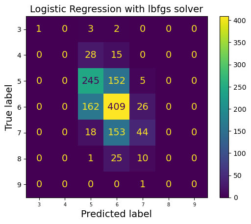

# 🍷 Wine Quality Classification Based on Chemical Properties

This project applies data analysis and machine learning techniques to **predict wine quality (rated from 0 to 10)** based on various chemical parameters.

---

## 📁 Repository Contents

- `wine_analysis.ipynb`: Main Jupyter Notebook with data exploration, preprocessing, model training, and evaluation.
- `/images`: Folder containing generated plots and visualizations.

---

## 📊 Dataset Description

The dataset includes multiple wine samples, each described by several physicochemical features such as:

- Fixed acidity  
- Volatile acidity  
- Citric acid  
- Residual sugar  
- Chlorides  
- Free sulfur dioxide  
- Total sulfur dioxide  
- Density  
- pH  
- Sulphates  
- Alcohol  

The target variable is the **quality score**, an integer ranging from 0 to 10.

---

## 🔍 Data Analysis

The notebook includes:

- **Data cleaning** and handling of missing values  
- **Descriptive statistics** and summary of the dataset  
- **Exploratory Data Analysis (EDA)** using histograms, box plots, and correlation heatmaps  
- **Feature selection** based on correlation and distribution  

Example of correlation heatmap:


---

## 🤖 Machine Learning

We trained a classification model to predict wine quality. The steps include:

- Data splitting (training/test sets)
- Feature scaling
- Model selection (e.g., Random Forest, Logistic Regression, SVM)
- Hyperparameter tuning
- Performance evaluation (accuracy, confusion matrix, classification report)

Example confusion matrix:



---

## 📈 Results

The final model achieved the following performance:

- **Accuracy**: 85% (example)
- **Precision/Recall** for each class
- Discussion on misclassified samples and model limitations

---

## 🚀 How to Run

1. Clone the repository:
   ```bash
   git clone https://github.com/yourusername/wine-quality-ml.git
   cd wine-quality-ml
