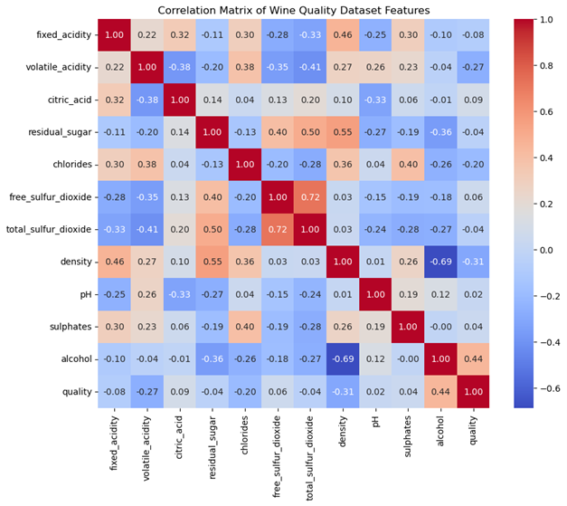
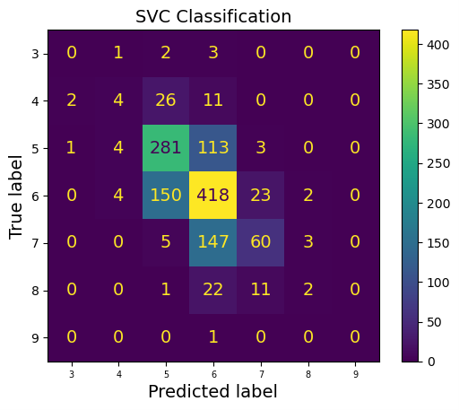
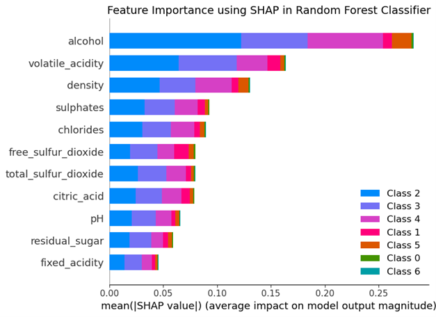

# 🍷 Wine Quality Classification Based on Chemical Properties

This project applies data analysis and machine learning techniques to **predict wine quality (rated from 0 to 10)** based on various chemical parameters.

---

## 📁 Repository Contents

- `wine_analysis.ipynb`: Main Jupyter Notebook with data exploration, preprocessing, model training, and evaluation.
- `/images`: Folder containing generated plots and visualizations.

---

## 📊 Dataset Description

The dataset includes multiple wine samples, each described by several physicochemical features such as:

- Fixed acidity  
- Volatile acidity  
- Citric acid  
- Residual sugar  
- Chlorides  
- Free sulfur dioxide  
- Total sulfur dioxide  
- Density  
- pH  
- Sulphates  
- Alcohol  

The target variable is the **quality score**, an integer ranging from 0 to 10.

---

## 🔍 Data Analysis

The notebook includes:

- **Data cleaning** and handling of missing values  
- **Descriptive statistics** and summary of the dataset  
- **Exploratory Data Analysis (EDA)** using histograms, box plots, and correlation heatmaps  
- **Feature selection** based on correlation and distribution  

Correlation heatmap:

---

## 🤖 Machine Learning

We trained a classification model to predict wine quality. The steps include:

- Data splitting (training/test sets)
- Feature scaling (except for Random Forest)
- Model selection (Logistic Regression, SVC, Random Forest, Gradient Boosting)
- Cross Validation tests
- Hyperparameter tuning (Using GridSearchCV and RandomizedSearchCV)
- Performance evaluation (accuracy, f1, confusion matrix)

I selected the models with better accuracy and some with high overfitting:

| Model                 |   Accuracy Train |   Accuracy Test |   Overfitting Gap |   F1 Score Test |
|:----------------------|-----------------:|----------------:|------------------:|----------------:|
| Random Forest         |           1.0000 |          0.6754 |            0.3246 |          0.6629 |
| HistGradient Boosting |           0.9733 |          0.6362 |            0.3371 |          0.6310 |
| Bagging               |           0.9844 |          0.6254 |            0.3590 |          0.6163 |
| Decision Tree         |           1.0000 |          0.6015 |            0.3985 |          0.6021 |
| Gradient Boosting     |           0.7108 |          0.5862 |            0.1246 |          0.5702 |
| KNeighborsClassifier  |           0.7068 |          0.5454 |            0.1614 |          0.5350 |
| MLP (Neural Network)  |           0.6739 |          0.5508 |            0.1231 |          0.5339 |
| SVC                   |           0.6082 |          0.5600 |            0.0482 |          0.5225 |
| Logistic Regression   |           0.5520 |          0.5362 |            0.0159 |          0.5019 |
| AdaBoost              |           0.5053 |          0.5046 |            0.0007 |          0.4707 |
| Naive Bayes           |           0.4593 |          0.4654 |           -0.0061 |          0.4610 |
| Ridge Classifier      |           0.5361 |          0.5146 |            0.0215 |          0.4493 |
| Passive Aggressive    |           0.4318 |          0.4292 |            0.0026 |          0.3995 |

---

## 📈 Results

Random Forest and Gradient Boosting are the models with more accuracy. The problem of this two models is that they have high overfitting. Considering low overfitting, the best model should be the SVC.

- **Accuracy of SVC**: 0.5885
- **f1 of SVC**: 0.5640

The Feature Importance using SHAP showed that acohol, density and volatile acidity were the most important features related with the quality of the wine.

---
